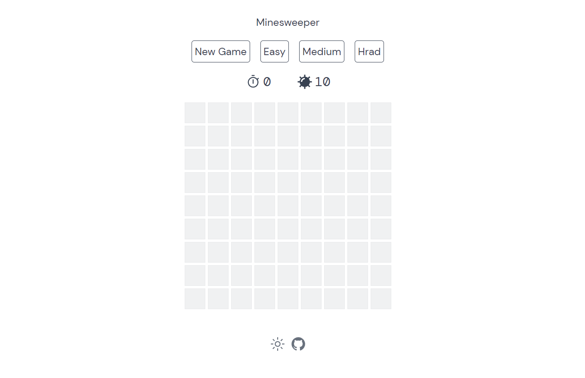

# 扫雷
这个小项目是跟着前端大佬 Anthony Fu 的B站直播写的，设计与实现基本模仿直播内容，但功能函数和代码结构部分有所不同。

大佬开源源码： [antfu/vue-minesweeper](https://github.com/antfu/vue-minesweeper)

我的GitHub链接： [BRR-bupt/minesweeper](https://github.com/BRR-bupt/minesweeper)

## Demo
[网页链接](https://mineswepper.netlify.app/)




## 🚀 Features

- 🎪 基于 **vue3** 框架开发
- ⚡ 基于 **vite** 开发，获取更快速的启动速度
- 🦾 完全使用 **typescript** 提供完备的代码类型检查
- 🔋 **unocss** 为本项目提供了 **attributify** 的css书写

## 🌸 Thanks
> 快速启动项目来自：[antfu/vitesse-lite](https://github.com/antfu/vitesse-lite)  
> 设计与实现方案源自：[antfu/vue-minesweeper](https://github.com/antfu/vue-minesweeper)

## 📦 Install
```bash
pnpm install
```

## 🦄  serve
```bash
pnpm run dev
```

## 🧱  build
```bash
pnpm run build
```

## 📄 License

**MIT License** © 2022-PRESENT [baoruirui](https://github.com/BRR-bupt)