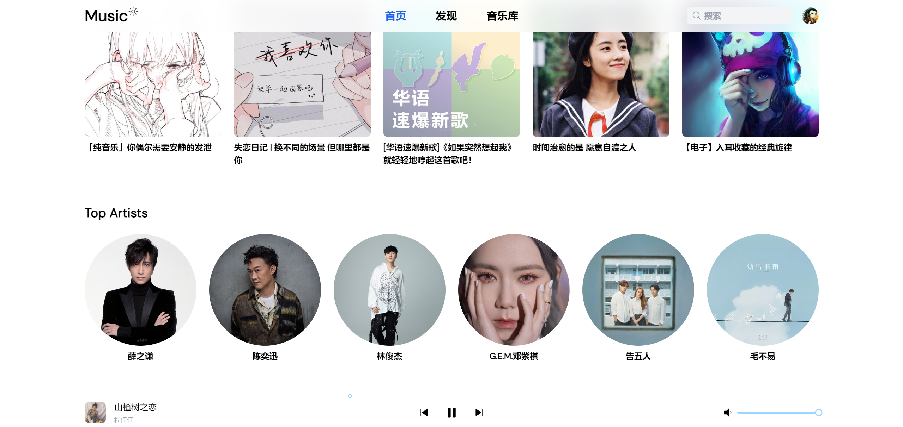

# 音乐播放器
[Github 链接](https://github.com/BRR-bupt/musicPlayer)

## Demo
[网页链接](http://buptyi.xyz:7000)




## 🚀 Features

- 🎪 基于 **vue3** 框架开发
- ⚡ 基于 **vite** 开发，获取更快速的启动速度
- 🦾 完全使用 **typescript** 提供完备的代码类型检查
- 🔋 **unocss** 为本项目提供了 **attributify** 的css书写

## 🌸 Thanks
> 后端完全来自：[网易云音乐api](https://github.com/Binaryify/NeteaseCloudMusicApi)  
> 设计灵感来源：[jiazengp/music](https://github.com/jiazengp/music?ref=vuejsexamples.com)

## 📦 Install
```bash
pnpm install
```

## 🦄  serve
```bash
pnpm run dev
```

## 🧱  build
```bash
pnpm run build
```

## 📄 License

**MIT License** © 2022-PRESENT [baoruirui](https://github.com/BRR-bupt)


