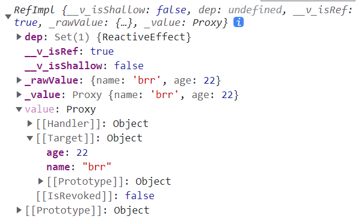

# ref & reactive
## 理解响应式数据
响应式数据的变化，可以被程序自动地**捕捉**到，并触发以该数据为**依赖**的所有**副作用**，如数据更新和视图更新。

这是普通数据办不到的，普通数据的变化，不会触发任何副作用，更别谈后续的数据、视图更新。

## ref & reactive 使用
`ref` 包装基本类型，创建出 `refImpl` 引用类型，原理是使用 `Object.defineProperty()` 添加 get 和 set 方法，等同于 Vue2 响应式

`reactive` 包装引用类型，创建出 `proxy` 代理对象，对于深层次的对象嵌套，通过递归层层创建 `proxy`
```ts
const msg = reactive({
  name: 'brr',
  age: 22
})
```


`ref` 也可以包装引用类型 **（推荐）**，将在 `reactive-proxy` 基础上，再进行一次整体的 `refImpl` 引用包装
```ts
const msg = ref({
  name: 'brr',
  age: 22
})
```


始终推荐使用 `ref` 包装引用类型，当需要对包装对象整体赋值事，仍会保持响应式，该情形在 `reactive` 中可能会报错。
```ts
const msg1 = ref({
  name: 'brr',
  age: 22
})
// 保持响应式
msg1.value = {
  gender: 1
}
  
const msg2 = reactive({
  name: 'brr',
  age: 22
})
// error
msg2 = {
  gender: 1
}
```

## reactive 解构
我么知道，解构 `reactive` 包装对象，里面的原始值会完全失去响应式，里面的嵌套引用值还将保持 `proxy` 代理状态。若要深层次的弄懂其中原理，必须看源码。

对于这种问题，常使用 `toRef()` 解决， 当然，更好的解决方案是不使用 `reactive` ，并且不使用解构。


## Pinia 响应式
`store` 是用 `reactive` 包裹的对象，所以具备响应式
- 注意不要解构，否则将失去 `reactive` 的响应式
- 解构后使用 `toRef()` 也可以重新获取响应式
