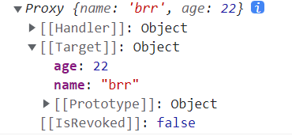

# 2022/10/05
## 理解响应式数据
响应式数据的变化，可以被程序自动地**捕捉**到，并触发以该数据为**依赖**的所有**副作用**，如数据更新和视图更新。

这是普通数据办不到的，普通数据的变化，不会触发任何副作用，更别谈后续的数据、视图更新。

## ref & reactive
`ref` 包装基本类型，创建出 `refImpl` 引用类型，原理是使用 `Object.defineProperty()` 添加 get 和 set 方法，等同于 Vue2 响应式

`reactive` 包装引用类型，创建出 `proxy` 代理对象，对于深层次的对象嵌套，通过递归层层创建 `proxy`
```ts
const msg = reactive({
  name: 'brr',
  age: 22
})
```


`ref` 也可以包装引用类型 **（推荐）**，将在 `reactive-proxy` 基础上，再进行一次整体的 `refImpl` 引用包装
```ts
const msg = ref({
  name: 'brr',
  age: 22
})
```


始终推荐使用 `ref` 包装引用类型，当需要对包装对象整体赋值事，仍会保持响应式，该情形在 `reactive` 中可能会报错。
```ts
const msg1 = ref({
  name: 'brr',
  age: 22
})
// 保持响应式
msg1.value = {
  gender: 1
}
  
const msg2 = reactive({
  name: 'brr',
  age: 22
})
// error
msg2 = {
  gender: 1
}
```

## reactive 解构
我么知道，解构 `reactive` 包装对象，里面的原始值会完全失去响应式，里面的嵌套引用值还将保持 `proxy` 代理状态。若要深层次的弄懂其中原理，必须看源码。

对于这种问题，常使用 `toRef()` 解决， 当然，更好的解决方案是不使用 `reactive` ，并且不使用解构。


## Pinia 响应式
`store` 是用 `reactive` 包裹的对象，所以具备响应式
- 注意不要解构，否则将失去 `reactive` 的响应式
- 解构后使用 `toRef()` 也可以重新获取响应式


## 浅拷贝 & 深拷贝
- 浅拷贝：只复制指向某个对象的指针（栈中存的内存堆地址），不复制对象本身，新旧对象指向同一块堆内存
- 深拷贝：开辟新堆内存，创建完全相同的对象，修改旧（新）对象，新（旧）对象不变

浅拷贝实现
```ts
const obj1 = {
  name: 'brr'
}
// 直接赋值
const obj2 = obj1
// 更改新对象值
obj2.name = 'zy'
// 旧对象值也变化，因为是引用值，指向同一堆内存
console.log(obj1.name)  // 'zy'
```

深拷贝实现 `Object.assign()`
```ts
const obj1 = {
  name: 'brr',
  school: {
    name: 'bupt'
  }
}
const obj2 = {}
// 通过 Object.assign() 赋值
Object.assign(obj2, obj1)
// 更改新对象值
obj2.name = 'zy'
// 旧对象值不变化，新开辟了内存
console.log(obj1.name)  // 'brr'

// Object.assign() 仅能进行非嵌套对象的深拷贝，嵌套值仍旧为浅拷贝
obj1.school.name = 'none'
console.log(obj2.school.name)  // 'none'
```


## __ _proto_ __ & prototype
> 首先我们要知道，在JS代码没有执行时，环境中已经创建了 `window` 对象，其中具有构造函数 `window.Object()` 和 `window.Array()` 以及 `window.Number()` 等。  
> 这些构造函数首先具备构造对象的能力，同时又天生注册了许多功能方法，如 Object 的 `valueOf()` , Array 的 `push()` , Number的 `toFix()` 等。这些方法都存在 `prototype` 属性中，存放在系统内存中。

`__proto__` 是对象的属性， `prototype` 是构造函数的属性。

当对象调用方法时，在本身未查找到，会查找其构造函数的方法，具体如下。

---
**举例**

看创建对象的例子

```ts
const obj = {}
obj.toString()
```

obj 上并不存在 `toString()` 方法，因为创建时，仅为空对象，但仍可以调用，是因为**原型链查找**，搜索到`obj.__proto__.toString()` 。

`obj.__proto__` 正是指向 `window.Object.prototype` 内存区，所以可以调用其中的方法。

---
再看创建数组的例子

```ts
const arr = []
arr.push(1)
arr.toString()
```

同样的，arr 创建时，仅为空数组，且不带有方法，`arr.push()` 来自于 `arr.__proto__` 指向 `window.Array.prototype` 的内存区，存储有 push、pop 等数组方法。

而调用 `arr.toString()` 时，在上述数组方法内存中不具备 toString() ，因此按原型链查找，到 `arr.__proto__.__proto__` ，即 `window.Array.prototype.__proto__` ，指向 `window.Object.prototype` 内存区，调用该方法。

>  因此我们发现 `window.Object.prototype` 是链的起始段，是所有对象上的方法查找的终点。起始段意味着无法再继续查找，即 `window.Object.prototype.__proto__` 为 `null`

---
**设想**

想象一下，如果没有 `prototype` ，那么就没有共享方法的内存区域，就不存在原生的 toString、push、pop 等一切非用户自定义方法。

如果没有 `__proto__` ，对象方法的查找将无所下手，只能通过自定义引用到原型（构造函数）中的方法，如下

```ts
const obj = {
  toString: window.Object.prototype.toString,
  valueOf: window.Object.ptototype.valueOf
}
obj.toString() // '[object Object]'
```

**总结**

`prototype` 是构造函数用来查找本身方法的属性， `__proto__` 是实例对象用来查找其原型上方法的属性。